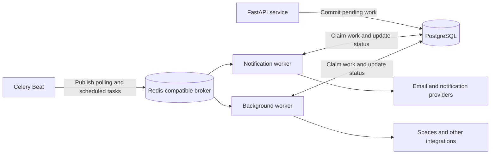

# Celery implementation and migration

Status: Draft for implementation review  
Date: 2026-09-12  
Scope: KampuLynk backend background execution on DigitalOcean App Platform
Author: Philips Effah

## 1. Objective and decisions

Move scheduled and request-triggered background work out of FastAPI processes. Keep existing business services and PostgreSQL records as the source of truth. Deploy Celery Beat for scheduling and Celery workers for execution, using a dedicated Redis-compatible broker.

This document proposes implementation; the described modules, flags, tables, and deployment commands are not yet implemented. It does not deploy infrastructure or change application behavior.

Initial decisions:

- Use separate API, Beat, notification worker, and background worker components from the same versioned container image.
- Run one active Beat scheduler. Scale execution workers independently.
- Use PostgreSQL to retain pending work, business status, execution leases, and recoverable failures. Do not rely on broker messages as the only record of accepted work.
- Keep existing database-backed transactional and bulk email processing initially.
- Use JSON messages containing IDs and schema versions. Do not serialize ORM objects, sessions, credentials, email bodies, or export passwords.
- Omit a Celery result backend initially. Existing status endpoints read PostgreSQL; operational monitoring uses logs and durable job records.
- Preserve business timing and feature flags, explicitly testing restart behavior and missed schedules.

### Why this migration is needed

The current API process owns both HTTP request handling and scheduled/background execution. This couples jobs to API deployments, restarts, and scaling. The code establishes this coupling; production latency or failure improvements must be measured rather than assumed.

| Current limitation | Reason to migrate | Expected result |
|---|---|---|
| Every API process starts APScheduler | Scaling the API also creates additional schedulers | API replica count can change without changing schedule ownership |
| Background tasks share the API process | Exports, email processing, and other jobs compete for its resources | Independently size and scale job execution while protecting API capacity |
| Request background tasks live in process memory | An API restart can interrupt accepted work without a durable execution handoff | Committed pending work can be recovered and executed by another worker |
| Jobs use different failure-handling patterns | Logged errors alone do not provide consistent retry and failure visibility | Standard task outcomes, bounded retries, and operational monitoring |
| Deployments restart scheduling with the API | API availability and job lifecycle are unnecessarily coupled | Separate execution components and explicit scheduler ownership during deployment |
| Long and short jobs have different resource needs | A long export should not delay transactional email processing | Independently consumed notification and background queues |

The migration is complete only when background work no longer depends on an API process staying alive. Celery provides scheduling and delivery mechanisms; durable records, claims, and reconciliation provide the application-level recovery guarantees.

### Hosting requirement

The complete application execution setup must run within **DigitalOcean App Platform**: one existing app containing the API Service and three Worker components (Beat, notifications, and background). Use a managed broker and the existing managed PostgreSQL database as connected dependencies. These managed databases may be provisioned separately in DigitalOcean and are not application Worker components.

No Droplet, manually maintained server, Kubernetes cluster, or operating-system cron service is required. A separate Worker component supplies the execution isolation requested here; it does not mean provisioning a separate virtual machine. The same repository/image is deployed with a different run command for each component.

## 2. Current implementation

`core/lifespan.py` starts APScheduler unconditionally after API initialization and shuts it down with the API. Each API process therefore owns a scheduler.

`core/scheduler/scheduler.py` registers:

| Work | Implementation | Current timing |
|---|---|---|
| Transactional email | `core.email_service.process_transactional_emails` | 60 seconds; immediate startup run |
| Bulk email | `apps.bulk_send.cron.process_bulk_emails` | 60 seconds; immediate startup run |
| Auto-moderation | `apps.moderation.services.auto_moderation_cron.process_auto_moderation` | Configurable; default 120 seconds; immediate startup run |
| Account deletion | `apps.user_deletion.cron.process_expired_account_deletions` | Configurable; default 24 hours; immediate startup run |
| Learning Spotlight | `apps.learningspotlight.cron.run_learning_spotlight` | Daily at 00:00 UTC |

APScheduler's `max_instances=1` only prevents overlap inside one process. The scheduler module documents email claiming and advisory locks for deletion and Spotlight; auto-moderation needs stronger protection against concurrent execution.

Other background entry points found during inspection:

- `apps/export/router.py` schedules `service.process_export` with FastAPI `BackgroundTasks`.
- `core/email_service.py` has both `BackgroundTasks.add_task` and `asyncio.create_task` delivery paths.
- `entrypoints/worker.py` is empty; `requirements.txt` already lists unpinned `celery`.
- `core/database/session.py` creates a module-level async engine and session factory, with optional `DISABLE_DB_POOL` support.
- Bulk email, deletion, and moderation cron wrappers catch and log exceptions. Spotlight returns structured outcomes. These are not automatically reliable Celery failure signals.

Implementation must inventory all callers of these helpers, including direct email delivery paths and export cleanup, before declaring all background work migrated. API-required recommendation model initialization is separate from job scheduling and remains unless endpoint dependencies justify moving it.

## 3. Target architecture



An optional post-commit publish accelerates processing. The periodic database sweep remains the recovery path if that publish fails. API acceptance means the work is committed durably, not that a broker publish succeeded.

DigitalOcean Workers are suitable long-running, non-routable components. Scheduled App Platform Jobs have a minimum 15-minute cadence and cannot preserve the current one-minute email polling. Use Worker components for Beat and execution. [Worker deployment](https://docs.digitalocean.com/products/app-platform/how-to/manage-workers/), [scheduled Jobs](https://docs.digitalocean.com/products/app-platform/how-to/manage-jobs/).

## 4. Code organization

Proposed files and changes:

| Location | Responsibility |
|---|---|
| `core/celery_app.py` | Celery construction, JSON configuration, explicit task imports, routing |
| `core/jobs/config.py` | Typed broker, rollout, retry, and schedule settings |
| `core/jobs/runtime.py` | Per-child async runtime, session/client initialization and cleanup |
| `core/jobs/schedule.py` | Beat schedule definitions and enabled-state handling |
| `core/jobs/claims.py` | Shared lease and execution ownership primitives |
| `core/jobs/models.py` and Alembic migration | Execution audit and additional durable work records where needed |
| `core/email_tasks.py` | Transactional delivery task adapters |
| `apps/*/tasks.py` | Explicitly named task adapters for each application |
| `core/lifespan.py` | Transitional scheduler flag, then removal of APScheduler lifecycle |
| `apps/export/router.py` and email helpers | Replace local background execution with durable submission |
| `.env.example`, `compose.yaml`, deployment documentation | Local broker/workers and configuration examples |
| `requirements.txt` | Pin a tested Celery release and compatible Redis transport dependencies |

Do not import `entrypoints.api` from workers. Keep FastAPI startup, migrations, and unnecessary ML imports out of Beat and Celery's parent process. Prefer explicit task imports over assuming autodiscovery finds nonstandard module locations.

## 5. Async execution model

Use standard Celery prefork workers with synchronous task entry points. Each worker child lazily creates one `asyncio.Runner` and runs async business functions on that same loop for its lifetime. Initialize loop-bound database and HTTP clients in the child; reuse them only on that loop. Do not create live connections before forking.

Refactor the global database setup into reusable factories while preserving the API dependency interface. A task opens and closes its own session; it never borrows a request session. On normal child shutdown, dispose the engine and close async clients on their owning loop, then close the runner. Abrupt termination must be recoverable without cleanup hooks.

Do not wrap every task with a fresh `asyncio.run()` while retaining pooled global clients. SQLAlchemy warns against sharing a pooled async engine across different loops. A per-task loop is an alternative only if every loop-bound resource is recreated and closed, with `NullPool` where appropriate. [SQLAlchemy async loop guidance](https://docs.sqlalchemy.org/en/20/orm/extensions/asyncio.html#using-multiple-asyncio-event-loops).

Load ML models lazily only in workers whose tasks require them. Start the background worker at concurrency 1 until measured memory usage justifies more processes. Configure bounded network timeouts, rollback on cancellation, and task-local cleanup.

## 6. Task catalog and scheduling

Proposed stable task names:

| Task | Queue | Trigger | Concurrency protection |
|---|---|---|---|
| `kampulynk.email.transactional.tick` | `notifications` | Every 60 seconds | Existing row claims, audited for crash recovery |
| `kampulynk.email.bulk.tick` | `notifications` | Every 60 seconds | Existing delivery claims |
| `kampulynk.moderation.tick` | `background` | Configured interval, default 120 seconds | Atomic claims or renewable lease |
| `kampulynk.deletion.tick` | `background` | Configured interval, default 24 hours | Existing advisory lock, eligibility recheck |
| `kampulynk.spotlight.tick` | `background` | `crontab(hour=0, minute=0)` in UTC | Lock plus unique business-date completion record |
| `kampulynk.export.process` | `background` | Export ID submitted after commit | Conditional state claim and lease |
| `kampulynk.reconcile.tick` | `background` | Proposed every 60 seconds | Bounded scan, atomic claims |

Reconciliation republishes pending exports or generic work, recovers expired claims, and detects missed scheduled business periods. It must tolerate duplicate publication. If background queue age grows, isolate reconciliation into a small control queue before scaling expensive workloads.

Keep existing feature flags and interval settings. Disabled jobs must skip safely inside the task even if already queued. Run deletion on an immediate controlled cutover sweep, then at the configured interval; changing it to midnight is a separate behavior change.

Beat interval schedules are not equivalent to APScheduler's immediate startup execution. A deployment checklist must trigger one initial sweep for interval work. Periodic due checks recover missed Spotlight dates according to an explicit policy: initially process the latest eligible date once; do not generate all historical dates automatically.

Beat requires a single scheduler; periodic tasks can still overlap and need execution locks. [Celery periodic tasks](https://docs.celeryq.dev/en/latest/userguide/periodic-tasks.html).

Initial Beat schedule storage may use an ephemeral local file because durable business records and reconciliation provide recovery. It is not authoritative last-run state. Deploy Beat with an explicit stop-old-before-start-new procedure and monitor active scheduler ownership. One configured replica alone does not prove there is no rolling-deployment overlap. If deployment controls cannot ensure this, implement a dedicated PostgreSQL connection advisory lock around Beat publication; loss of the lock connection must stop publication. Validate this before production.

## 7. Durable work and correctness

### Submission and dispatch

Use existing email and export records wherever possible. For work without a durable record, add a work/outbox table with ID, task type, payload version, entity ID, idempotency key, status, available time, attempt count, lease owner/expiry, timestamps, and sanitized last error. Add a unique constraint for the logical idempotency key and an index for due pending work.

Create the business update and corresponding pending work in the same database transaction. After commit, optionally publish the ID through a bounded producer operation; keep synchronous broker I/O off the API event loop. A failed publish leaves the durable record pending for the next sweep. Do not report failure for an already accepted operation solely because the acceleration publish failed.

The dispatcher claims due rows in bounded batches using row locking with `SKIP LOCKED`, publishes after releasing the short transaction, and records publication. A crash after publication can cause a duplicate. Retain a delivery deadline and reconcile published-but-unclaimed work too; marking a record published must not make a lost broker message unrecoverable.

### Execution and external effects

Workers atomically claim an eligible entity with a lease, then perform work outside a long database transaction. Renew leases for long execution. Completion updates must check the ownership token, so an old worker cannot overwrite a newer owner's result. Reclaim only expired leases; business checks still apply on retry.

- Email: preserve recipient/delivery identity and existing claim logic. Provider acceptance followed by a database failure can still produce duplicate delivery without provider-supported idempotency. Record provider IDs where available and classify uncertain sends for reconciliation.
- Export: claim by export ID, retain deterministic storage keys, avoid duplicate ready emails, clean temporary files, and recover abandoned processing states.
- Moderation: replace marker-only overlap protection with claims; deduplicate enforcement actions by content and decision version.
- Deletion: recheck cancellation and eligibility before irreversible steps; record resumable progress across partial external cleanup.
- Spotlight: a concurrency lock alone does not prevent sequential duplicate generation. Enforce uniqueness by applicable business date.

Preserve advisory locks only after verifying they stay on the same physical PostgreSQL connection across the entire protected operation. A session commit can change connection ownership; do not assume a session object guarantees this.

## 8. Failures, retries, and configuration

Task adapters must call service functions that raise actionable failures or interpret structured outcomes. Change cron wrappers that swallow exceptions, or bypass those wrappers. Distinguish completed, disabled, already completed, lock unavailable, transient failure, and permanent failure. Lock contention is an expected skip, not a reason for a tight retry loop.

Retry transient connection failures, rate limits, and eligible provider errors with capped exponential backoff and jitter. Honor provider retry guidance. Do not retry validation failures or permanent authorization errors indefinitely. Start with at most five application attempts; record terminal failure and support audited replay by entity ID.

Use late acknowledgements only after a task has duplicate protection. Worker-loss rejection is task-specific and requires a durable attempt cap to prevent poison-message loops. Celery acknowledges some terminated tasks even with late acknowledgement, and explicit retries are distinct from redelivery. [Celery task acknowledgement and retry behavior](https://docs.celeryq.dev/en/latest/userguide/tasks.html).

Baseline configuration to implement:

```python
task_serializer = "json"
accept_content = ["json"]
result_serializer = "json"
task_ignore_result = True
timezone = "UTC"
enable_utc = True
worker_prefetch_multiplier = 1
broker_connection_retry_on_startup = True
```

Define per-task soft/hard time limits from measured runtimes. Break oversized jobs into bounded batches. Set the broker visibility timeout above the longest allowed unacknowledged execution with margin; a larger value delays crash recovery. Configure the documented matching visibility settings for the selected transport/backend, and verify with forced termination tests. Avoid distant ETA messages; store future due times in PostgreSQL. [Celery Redis transport](https://docs.celeryq.dev/en/v5.6.2/getting-started/backends-and-brokers/redis.html).

The broker must use TLS with certificate verification, private/trusted access, monitored capacity, and a non-evicting queue-compatible configuration. Select and test the actual managed Redis-compatible product and transport versions; compatibility is a deployment prerequisite, not assumed from branding. Keep broker secrets out of logs and source control.

## 9. DigitalOcean deployment

### App layout

Add these resources to the existing KampuLynk app:

| Component name | App Platform resource type | Initial instances | Purpose |
|---|---|---|---|
| Existing API component | Web Service | Preserve existing configuration | Public HTTP API |
| `kampulynk-beat` | Worker | 1 active owner | Publish scheduled tasks |
| `kampulynk-notifications` | Worker | 1, with 2 child processes initially | Consume `notifications` |
| `kampulynk-background` | Worker | 1, with 1 child process initially | Consume `background` |

Instance counts and Celery child concurrency are different settings. Increasing either execution-worker setting increases resource and database demand. Do not autoscale Beat.

### Control-panel setup

1. In DigitalOcean, open **Apps**, then select the existing KampuLynk app.
2. Choose **Add components → Create resources from source code**. Select the backend repository and the intended deployment branch, using the repository root as the source directory.
3. Set resource type to **Worker**, name the component `kampulynk-beat`, retain the existing Dockerfile build, and override the run command with the Beat command below.
4. Repeat for `kampulynk-notifications` and `kampulynk-background`, using their respective commands. Configure worker instance sizes from staging measurements and the initial instance counts above.
5. Provision a managed Redis-compatible broker in a suitable DigitalOcean region and authorize the app through the managed database's supported trusted-source/network settings. Authorize the workers' access to the existing PostgreSQL database as well. Verify connectivity from deployed components rather than assuming same-region placement grants access.
6. Add broker and database URLs as encrypted runtime environment variables. Add provider credentials only to the execution components that need them. Shared app-level settings may hold nonsensitive configuration; component-level settings distinguish API and worker behavior.
7. Keep Beat publication and new background producers disabled during initial deployment. Follow the controlled cutover in section 10 before activating real jobs.
8. Inspect each component's runtime logs, send an isolated task through each queue, and verify database status updates. Confirm that only the API component receives public HTTP traffic.

An App Spec can later codify this same layout: retain the existing `services` entry and add three entries under `workers`, each with its own name, source/image, `run_command`, instance settings, and environment variables. Do not replace the existing app spec with a workers-only fragment. Export and review the full current spec before automating updates.

Use the existing Dockerfile initially and override its API command per component. These commands reference the proposed Celery module:

```bash
# Existing API service
uvicorn entrypoints.api:app --host 0.0.0.0 --port 8080

# One Beat component; writable but disposable schedule file
celery -A core.celery_app:celery_app beat --loglevel=INFO --schedule=/tmp/celerybeat-schedule

# Notification Worker component
celery -A core.celery_app:celery_app worker --loglevel=INFO --queues=notifications --concurrency=2

# Background Worker component
celery -A core.celery_app:celery_app worker --loglevel=INFO --queues=background --concurrency=1
```

In App Platform, add each component from the same source/image, select Worker, and set its command and component-scoped secrets. Keep task names and payloads compatible across rolling API/worker versions. Ensure all declared routes have a consumer; reject unknown task types in durable submissions.

Proposed settings:

| Setting | Purpose |
|---|---|
| `CELERY_BROKER_URL` | TLS broker URL, secret |
| `JOBS_SCHEDULER_MODE` | Transitional `apscheduler`, `celery`, or `off`; API consults this before starting its scheduler |
| `BACKGROUND_EXECUTION_MODE` | Transitional `local` or `celery` for request-triggered paths |
| `DATABASE_URL` | Shared PostgreSQL, least required privileges |
| Existing job flags and intervals | Preserve current behavior |
| Existing provider credentials | Scope to the execution components requiring them |

Mode flags must not silently fall back to local execution after a broker failure. Beat requires its own publication enable/ownership control. Modes must be set consistently per deployment.

Run additive migrations once before enabling consumers, not from every worker or API replica. Disable automatic DB initialization in execution components. Check total database connections across API pools, worker children, advisory-lock connections, and old/new deployment overlap against the database limit.

Measure CPU, memory, task duration, and queue age in staging before selecting production instance sizes. Test App Platform termination behavior and ensure unfinished tasks are recovered when platform grace time is shorter than execution time. No public worker endpoint is required. See [DigitalOcean Worker setup](https://docs.digitalocean.com/products/app-platform/how-to/manage-workers/).

## 10. Implementation and rollout phases

| Phase | Deliverable | Exit condition |
|---|---|---|
| 1. Foundations | Pinned dependencies, local broker, Celery configuration, async runtime, deployment mode flags | Real prefork worker processes a DB-backed test task repeatedly without loop/fork errors |
| 2. Durable execution | Claims, failure propagation, idempotency, recovery scans, migrations | Crash and duplicate-delivery tests pass |
| 3. Scheduled adapters | Five existing jobs mapped to Celery, schedule tests | Staging timing and disabled behavior match requirements |
| 4. Request tasks | Durable exports and all background email paths | Accepted work survives broker outage and API restart |
| 5. Production cutover | Workers, controlled scheduler ownership switch, observability | API logs show no local job execution; queues drain and due work completes |
| 6. Cleanup | Remove APScheduler and transitional local execution paths after observation | No remaining runtime dependency on the old scheduler or local background execution |

Production cutover procedure:

1. Apply backward-compatible schema changes and deploy code with existing execution modes retained. Provision the broker and workers; keep Beat stopped and new producers disabled.
2. Verify registered tasks, queue routing, credentials, DB connectivity, and an isolated canary with no production side effects.
3. Set API scheduler mode to `off`; complete deployment and verify every old API scheduler has stopped. Allow already-running jobs to finish or recover their leases.
4. Start the single Beat owner and set the scheduler mode consistently to `celery`. Trigger the controlled initial sweep and verify all five job outcomes. Accept a short deliberate scheduling gap rather than uncontrolled dual execution.
5. Switch request-triggered execution to `celery`. Let already-running local tasks drain. Atomic claims must protect overlap during the API rollout.
6. Verify exports, transactional and bulk delivery, moderation, deletion eligibility, and Spotlight date uniqueness. Observe at least a full daily cycle and an account-deletion interval before removing rollback paths.

## 11. Rollback

If only task code is faulty, pause affected durable dispatch/task families and deploy the last compatible worker version while retaining accepted records. Do not purge the broker or drop additive schema changes.

To restore APScheduler, stop Beat publication first, stop new Celery dispatch for the affected families, drain or stop their consumers, and establish which leases remain active. Only then enable the API scheduler. A queued Celery task can still run after Beat stops; draining consumers is part of ownership transfer.

Keep Celery export consumers available for already accepted exports until those complete or an explicit database recovery procedure transfers ownership. Re-enabling local mode only affects new requests and does not consume existing queued work automatically. Reconcile failed/uncertain external effects before replay. Record rollback time and compare pending counts before and after recovery.

## 12. Validation and operations

Required tests use real PostgreSQL, a real broker, and separate prefork worker processes; eager-mode unit tests alone cannot validate this migration.

| Scenario | Required result |
|---|---|
| Repeated async tasks in a reused child | No cross-loop errors, inherited connections, or leaked sessions |
| Concurrent duplicate tasks | One logical effect or explicit provider ambiguity record |
| Broker unavailable after DB commit | API-accepted work remains discoverable and eventually executes |
| Worker killed before/after external effect | Lease recovery works; uncertain effects are reconciled |
| Exceptions in legacy cron services | Celery failure/retry status reflects actual outcome |
| Two overlapping scheduler processes | Ownership guard or deployment control prevents dual publication; task dedup remains effective |
| Beat restart/midnight downtime | Latest eligible Spotlight date recovered once |
| Long export and email arrival | Notification queue remains independently serviceable |
| Feature disabled or deletion cancelled | Already queued tasks recheck current state and skip safely |
| Rollback with pending messages | No orphaned accepted work and no dual execution owner |

Emit task name/ID, entity ID, attempt, queue delay, duration, outcome, and sanitized error classification. Track oldest pending durable work, broker queue depth, expired leases, terminal failures, last successful poll per family, scheduler ownership, worker memory, and database saturation. A running container or Celery ping does not prove useful work is completing.

Initial alert targets, to tune in staging: notification oldest-pending age over five minutes; three missed polling windows; reconciliation stale for five minutes; no eligible Spotlight completion by 01:00 UTC. Alert separately on disabled jobs to avoid false failure signals. Define the deletion completion threshold from its configured interval and measured runtime.

Acceptance requires all five schedules and every identified request-triggered background path executing outside the API, successful broker-outage/crash/rollback drills, bounded retries, preserved API status behavior, and a production observation cycle without unexplained missing or duplicate work.

## 13. Decisions to finalize during implementation

- Managed broker product/version, capacity, persistence, and failover behavior validated with the pinned Celery transport.
- Per-task limits, lease duration/renewal interval, and production worker sizes based on staging measurements.
- Beat deployment ownership mechanism, including proof of behavior during App Platform updates.
- Full direct-send/notification caller inventory and ownership of export expiration cleanup.
- Provider-specific policy for email delivery that succeeded externally but was not recorded locally.
- Operational owner for alerts, failed-work review, replay, and production cutover.
